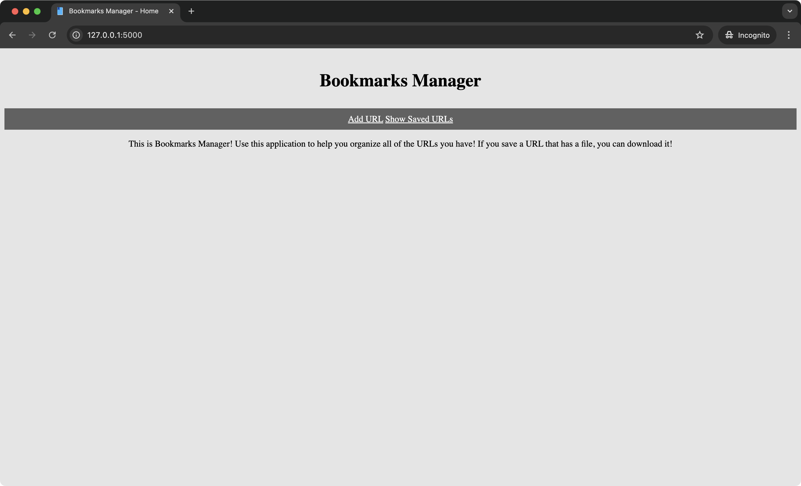
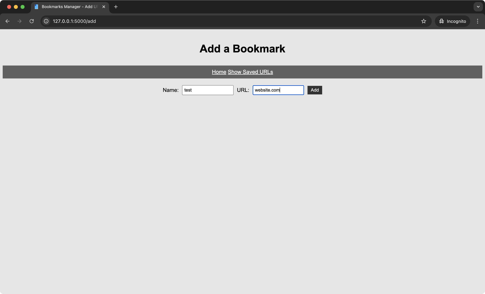
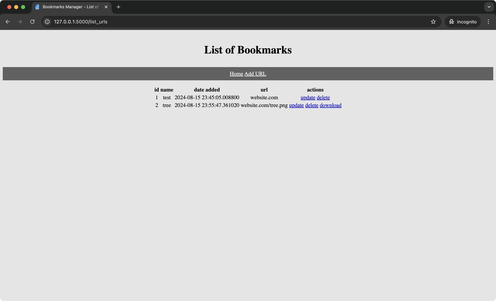
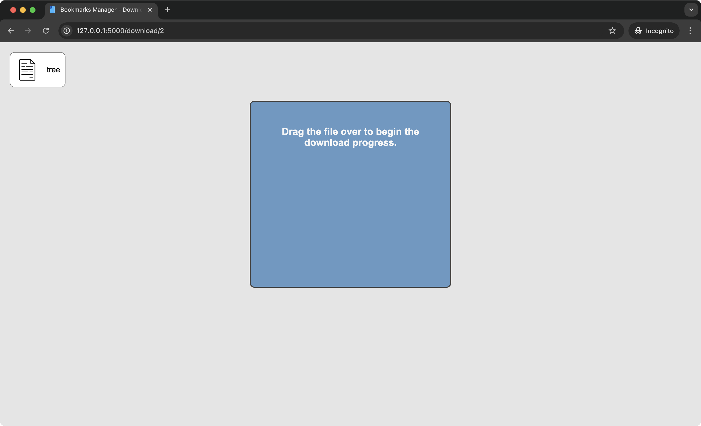
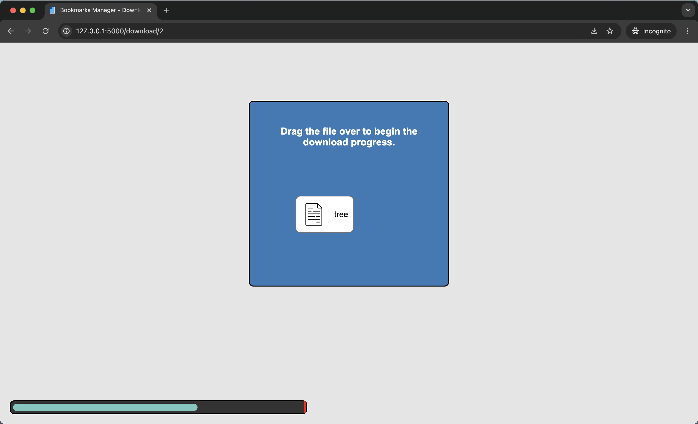

# bookmarks-manager

This project is created for the Coding with Lewis Hackathon.

## About

This application is a web-based bookmarks URL manager.
Users will be allowed to copy their URLs and add them to a table within the application.
Users will also be able to update the URL and delete the URL from the table.
In addition, if the user added a link that points to a file (e.g., a png), then a download link will be present in the table.

As part of the theme, instead of a typical download, the user will have to drag a file icon to a designated area.
This area is meant to represent a photocopy machine that signifies the user is copying the file to their local drive.

## Getting Started

At the time of development, the project used Python version 3.12.4.

Create a virtual environment with Python. In this case, it is “hackathon”.
```zsh
python -m venv hackathon
```

Activate the virtual environment by using the suitable `activate` script found in the folder created. The virtual environment can be deactivated by using the command: `deactivate`.
```zsh
source ./hackathon/bin/activate
```

Next, install all of the required packages.
```zsh
pip install -r requirements.txt
```

Execute the following command to get the database initialized.
```zsh
flask –app bookmarks_manager init_db
```

Execute the following command to get the website running.
```zsh
flask --app bookmarks_manager run
```

## Screenshots







